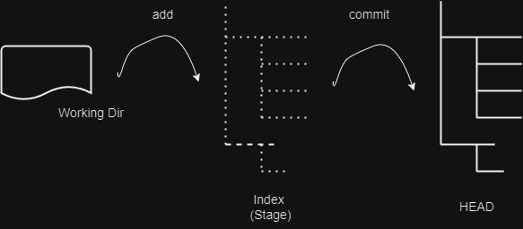

# GIT

1. Quy trình làm việc

Thư mục cục bộ của bạn bao gồm ba "trees" được duy trì bởi git.

- Đầu tiên là Thư Mục Đang Làm Việc (Working Directory) có chứa các tập tin hiện tại.
- Cái thứ hai là Chỉ Mục (Index) đóng vai trò như staging area
- Cuối cùng là HEAD trỏ đến commit gần đây nhất của bạn.

  

2. Các từ khóa cần biết trong git

- **Git** : Tên hệ thống quản trị mã nguồn và nó không phải Github.
- **Github** : Là một dịch vụ lưu trữ và chia sẻ mã nguồn sử dụng hệ thống quản trị Git, ngoài ra có Azure DevOps, Bitbucket…
- **Repositories** : Là nơi đặt mã nguồn git, thường là 1 project sẽ tạo 1 Repository riêng hoặc 1 Repository chứa nhiều mã nguồn nhiều project con. Nói chung nó là một bộ mã nguồn nếu muốn lưu trữ trên git thì chúng ta đều phải tạo ra 1 repository và đẩy code lên đó. Thường thì 1 account Git hoặc 1 project sẽ cho tạo nhiều Repository trên đó.
- **Branch** : Mỗi một repository chúng ta chia ra nhiều nhánh code, để giúp các developer hay nhóm phát triển các tính năng độc lập của phần mềm mà không bị ảnh hưởng đến nhau, mỗi nhánh sẽ là một danh sách các commit mà không ảnh hưởng đến danh sách commit của nhánh khác, chúng được sắp xếp theo thời gian trước sau. Chỉ khi merge nhánh này với nhánh kia thì code mới được nhập chung với nhau.
- **Commit** : Mỗi lần chúng ta làm xong chúng ta muốn báo cho Git lưu lại các thay đổi so với code nguyên bản trước khi sửa thì chúng ta cần lưu lại các thay đổi trong commit. Một commit là một lần chúng ta lưu lại code vào Git nó sẽ tự sinh ra 1 commit Id, chúng ta có thể quay về bất cứ commit nào trong lịch sử sửa code. Hoặc là tra xem sự khác nhau giữa các commit ra sao?
- **Merge code** : Là hành động merge code giữa 2 nhánh code từ một nhánh A vào 1 nhánh B hoặc ngược lại, nhánh được merge sẽ chứa code của cả 2 nhánh và tạo ra một commit mới là merged commit.
- **Rebase code** : Cũng là một hành động merge code nhưng không tạo ra commit mới là merged commit mà sắp xếp các commit theo thứ tự thời gian của cả 2 nhánh, history sẽ đẹp tuy nhiên 2 nhánh mà lâu không rebase sẽ phải so sánh theo thời gian từng commit một sẽ mất thời gian.
- **Conflict** : Là sự xung đột khi merge code hay rebase khi mà cả 2 thành viên cùng sửa một đoạn code ở cả 2 nhánh lúc merge vào sẽ xung đột và Git hỏi xem muốn lấy sự thay đổi nào hoặc lấy cả 2.
- **Stash** : Là tính năng lưu tạm các sự thay đổi vào local khi chúng ta đang làm code dở ở nhánh A nhưng lại chưa muốn commit thì chúng ta phải sang nhánh B để fix bug nên chúng ta phải stash lại để không bị mất code cũng không phải commit. Khi quay lại nhánh A sẽ apply stash để sửa tiếp.
- **Gitignore** : Là file nằm trong repository chúng ta tạo ra với tên. gitignore nằm liệt kê các file hay folder nằm trong folder git mà chúng ta không muốn git tracking mà chỉ lưu ở local thôi. Nó sẽ không đánh dấu sự thay đổi khi có thay đổi trong cac file này.
